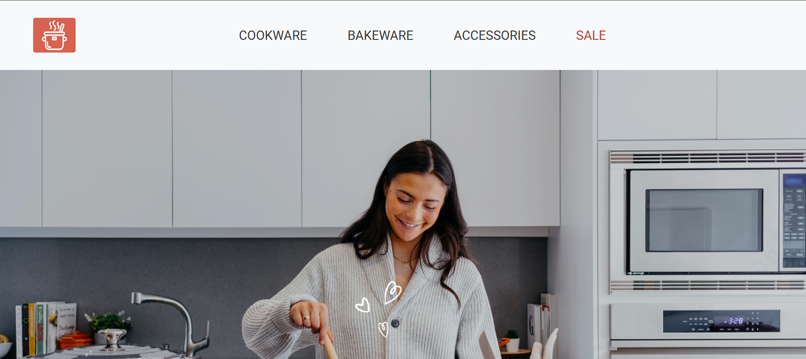

# Cookware Website

**Description**: Create a functioning website using bootstrap, flex and grid based off a mockup that was provided.

**Name**: Michael Heckerman

**Date**: 11/12/24

**Github**: https://github.com/mkheck13/cookingsite

**Vercel**: https://cookingsite.vercel.app/

**Prototype**: https://www.figma.com/proto/r5mPHG6c8kRhWrrhorOL2n/CodeStack-Academy-Website?type=design&node-id=15-25&viewport=1541%2C555%2C0.26&t=Hy6Dld3nRlBmvw2B-0&scaling=min-zoom&starting-point-node-id=15%3A25&show-proto-sidebar=1

### Peer Review:
**Name**: 

**Comments**: